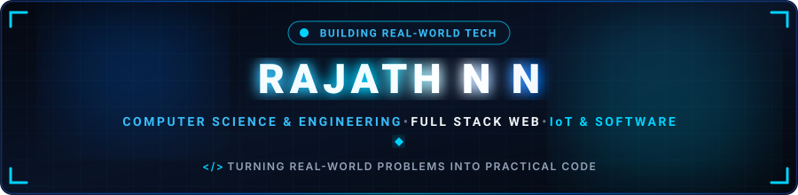
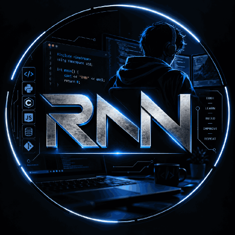
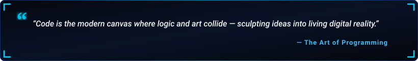

  

  

  

  
  &nbsp;
  
  &nbsp;
  
  &nbsp;
  
  &nbsp;
  

  

---

<h2 align="center">🔹 About Me</h2>

  

  

  Hey! I'm <b>RAJATH N N</b>, a passionate <b>Computer Science and Engineering student</b> at <b>Atria Institute of Technology (AIT), Bengaluru</b> based in <b>Bengaluru, Karnataka, India</b>.  
  I am interested in <b>software development, web development, IoT, and emerging technologies</b>. I enjoy building practical projects, learning new technologies, and solving real-world problems through technology. I am continuously improving my programming and development skills while working on academic and personal projects.

  
  &nbsp;
  
  &nbsp;
  
  &nbsp;
  

  💬 <b>Let's Discuss:</b> C, C++, Python, Java, JavaScript, SQL, Web Development &amp; IoT. 
  🎯 <b>Career Goal:</b> <i>"To become a skilled software engineer and build innovative, scalable, and user-focused technology solutions."</i>

<table width="100%" border="0" align="center">
<tr>
<td width="50%" align="center" style="padding: 14px;">
  <h4>🔭 Flagship Project</h4>
  
<a href="https://github.com/rajath-nn?tab=repositories" target="_blank"><b>Child Safety Wearable</b></a> IoT-based Child Safety &amp; Tracking System

</td>
<td width="50%" align="center" style="padding: 14px;">
  <h4>🌱 Active Deep Dives</h4>
  
<b>Full-Stack Web &amp; DSA</b> React.js, Node.js, SQL &amp; Algorithms

</td>
</tr>
<tr>
<td width="50%" align="center" style="padding: 14px;">
  <h4>📱 Social Connect</h4>
  
<a href="https://www.instagram.com/rajath_nn" target="_blank"><b>@rajath_nn</b></a> Follow on Instagram

</td>
<td width="50%" align="center" style="padding: 14px;">
  <h4>🤝 Collaboration &amp; Opportunities</h4>
  
<b>Software, Web &amp; IoT</b> Open to internship opportunities &amp; projects

</td>
</tr>
</table>

---

<h2 align="center">🔹 Featured Project Spotlight</h2>

<table width="100%" border="0" align="center">
<tr>
<td align="center" style="padding: 22px;">
  <h3>🛡️ Child Safety Wearable</h3>
  
<i>An IoT-based child safety and tracking wearable system engineered for real-time location monitoring, safety alerts, and remote protection.</i>

   
  

    
    &nbsp;&nbsp;
    
  

</td>
</tr>
</table>

---

<h2 align="center">🚀 Featured Projects &amp; Work</h2>

<table width="100%" border="0" align="center">
<tr>
<td width="50%" align="center" style="padding: 16px; vertical-align: top;">
  <h4>🛡️ Child Safety Wearable</h4>
  
<b>IoT &amp; Tracking System</b>

  
IoT-based child safety and tracking system designed with emergency alert features and real-time location monitoring.

  

    
    
  

  
<a href="https://github.com/rajath-nn?tab=repositories" target="_blank"><b>View on GitHub &rarr;</b></a>

</td>
<td width="50%" align="center" style="padding: 16px; vertical-align: top;">
  <h4>♻️ Smart Garbage Monitoring System</h4>
  
<b>IoT &amp; Sensor Analytics</b>

  
IoT system for real-time monitoring of garbage levels in waste bins to optimize urban waste collection and sanitation.

  

    
    
  

  
<a href="https://github.com/rajath-nn?tab=repositories" target="_blank"><b>View on GitHub &rarr;</b></a>

</td>
</tr>
<tr>
<td width="50%" align="center" style="padding: 16px; vertical-align: top;">
  <h4>🔐 Full-Stack Login System</h4>
  
<b>Full-Stack Web Development</b>

  
Secure authentication and user management platform with a React/HTML-CSS frontend and robust Node.js &amp; SQL backend.

  

    
    
  

  
<a href="https://github.com/rajath-nn?tab=repositories" target="_blank"><b>View on GitHub &rarr;</b></a>

</td>
<td width="50%" align="center" style="padding: 16px; vertical-align: top;">
  <h4>📊 Student Management &amp; Dashboard</h4>
  
<b>Web Application &amp; Databases</b>

  
Academic dashboard for managing student profiles, records, academic performance, and structured administration workflows.

  

    
    
  

  
<a href="https://github.com/rajath-nn?tab=repositories" target="_blank"><b>View on GitHub &rarr;</b></a>

</td>
</tr>
</table>

---

<h2 align="center">🧩 LeetCode Problem Solving</h2>

<i>Live real-time tracker of coding challenges &amp; algorithmic problem-solving milestones.</i>

  

  
  &nbsp;&nbsp;
  

---

<h2 align="center">🛠️ Tech Stack &amp; Skills</h2>

<b>Core Programming Languages</b>

  

<b>Frontend Development</b>

  

<b>Backend &amp; Databases</b>

  

<b>Tools, Hardware &amp; Environments</b>

  

  
  &nbsp;
  
  &nbsp;
  
  &nbsp;
  
  &nbsp;
  
  &nbsp;
  

---

<h2 align="center">📊 GitHub Analytics &amp; Activity</h2>

  
  &nbsp;&nbsp;
  

  

  

---

<h2 align="center">⚡ Contribution Journey</h2>

  

---

<h2 align="center">📬 Let's Connect &amp; Collaborate</h2>

<i>Whether you want to discuss software engineering, IoT, web platforms, open-source projects, or internship opportunities — my inbox is always open!</i>

<table border="0" align="center">
<tr>
<td align="center" width="200" style="padding: 16px;">
  <a href="https://www.linkedin.com/in/rajath-n-n-6a8198387" target="_blank">
    
      
    
  </a>
   
  <b>Professional Network</b>
</td>
<td align="center" width="200" style="padding: 16px;">
  <a href="https://leetcode.com/u/Rajath_nn/" target="_blank">
    
      
    
  </a>
   
  <b>Problem Solving &amp; DSA</b>
</td>
<td align="center" width="200" style="padding: 16px;">
  <a href="https://www.instagram.com/rajath_nn" target="_blank">
    
      
    
  </a>
   
  <b>Social &amp; Updates</b>
</td>
<td align="center" width="200" style="padding: 16px;">
  <a href="mailto:rajathnn8@gmail.com">
    
      
    
  </a>
   
  <b>Direct Collaboration</b>
</td>
</tr>
</table>

  

